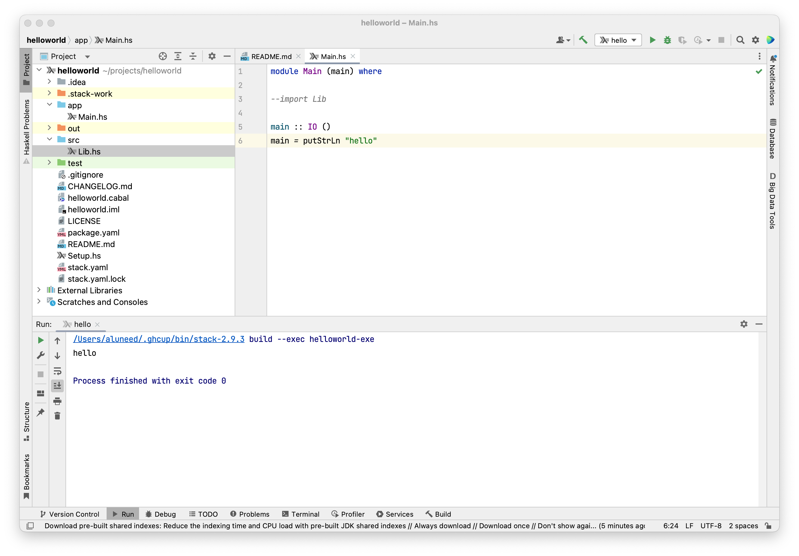

<!--meta
id: 2
title: haskell环境
date: 2023-04-22
tags: haskell, env, trivial, ghc, ghcup, stack
category: blog
type: blog
meta-->

去年下半年做了一个决定, 不再碰新的语言(除非为godot编写脚本)  
于是日常要找点乐子, 就只能从scala, typescript, scheme中选择  

scala还不错, 除了它的泛型参数是写在`[]`以外, 我没有什么怨言(也许有别的, 但我已经忘了).  
但是scala3的生态, 实在是太垃圾了. jetbrains的scala3插件, 对一段语法非常简单的代码的错误提示在编译后才会发生变更, 不知道现在有没有修复这个问题.  
说到底, 我最后丧失了对scala的需求, 因为我发现想要的功能在scala中仍然是通过运行时反射实现的. 那我为什么不用java?  

typescript使用体验还不错, 但也就那样了. 它的设计目标就只是一个js-plus, 不多也不少.  
ts支持重载, 但又没有完全支持. 能重载的就只有signature, 代码段还是得写在一起. 这也不是什么大问题, 只要有模式匹配就行了, 但它没有. 这种为了保证和编译后js代码一致的目标带来了一系列的设计问题. 有人提到与其用这种重载, 还不如重新起一个不错的名字. 的确如此, ts以这种方式支持重载, 还不如直接把这个特性去掉.  
当然了, 手写分支虽然丑陋, 但还是可以让这几个重载看上去像一个函数, apply时起码能在编译期进行一些检查  
ts团队说他们从未想过取代js, 显然这是实话: ts就是且也只是一个为有着更多需求的js用户设计的语言  
不过反正都有babel了, 很容易做到更激进的事, ts拿来拧拧螺丝得了  

scheme我不知道该如何评价. 作为lisp方言, 它很有趣, 但是不管写起来还是读起来都太累.  
我已经琢磨出了一套好看的缩进规则, 但少数时候和语义不太一致. 别人写的scheme代码看起来就更痛苦了.  
drRacket能勉强拿来调试, 但它的编辑器很不好用. 我几乎所有的scheme代码都是在vscode里写的, 但也仅仅是有高亮而已  
刷sicp时, 经常会蹦出一些根本没有出现过的过程, 我只能挨个实现(有时候是从前面复制), 让一个文件中包含了太多的代码, 这些代码之间还没法跳转到过程. 我很后悔没有安装sicp的过程包, 这让我承受了太多痛苦, 最终丧失了乐趣  
缺少类型支持导致了我最大的痛苦. 类型可以让人快速地聚焦到一个变量上 - 不是通过变量名去识别, 而是先通过类型去筛选(zoom in to a smaller scope)  

既然是找乐子, 那就不该做让自己痛苦的事情, 于是我开始寻找一个写起来轻松, 有趣, 并且教程简单易懂的语言  
其实也没有太多选择, 看上去不错的教程就只有beautiful racket和learn you a haskell for great good  

后者其实我在前年拿来当床头书籍, 偶尔看看有助于睡眠, 搬家的时候不知道收哪儿去了  
最近又看了下目录, 感觉有点意思, 还是实践下吧  
至于为什么没有选择racket, 因为typed/racket仍然不是主流, 没有类型只会让写代码变得很累  

## ghcup

我很早以前就通过brew安装了ghcup, 打开来看到有新版本, 那就先升个级吧  
结果ghcup没法给自己升级, 排查半天原来还是brew导致的(又一次!)  

删了brew版准备跑官网脚本安装  
卒

卡在cabal安装后的初始化了  
参考这个issue  
https://gitlab.haskell.org/haskell/ghcup-hs/-/issues/229  
看了半天它的安装脚本没看明白  
~/.ghcup/bin下的ghcup只有300多kB, 根本运行不了  


https://www.haskell.org/ghcup/install/#manual-installation

最后老老实实下载绿色免安装版了  
下下来发现, 这玩意儿其实就只有一个单二进制文件  
就这么一个东西, 那个垃圾安装脚本还要先装nm个全家桶, 还不让选, 比360都过分  
cabal明明在ghcup里就可以正常安装  

把这个单一可执行文件挪到~/.ghcup/bin中, 加上推荐的path设置就可以了  
(如果没有之前的安装过程, 那么下载下来的可执行文件最好重命名为`ghcup`, 然后手动创建`~/.ghcup/bin`路径)  
(如果下载的可执行文件缺少权限, 可能还需要`chmod +x ./ghcup`, 要不就得一直sudo运行; 第一次执行后会被macos拦截, 需要到设置-隐私与安全性中去允许运行)  


ghcup tui打开之后, i安装s设置, 安装了的会有一个钩, 设置好了会有两个钩  
想干啥干啥, cabal安装和设置也没什么问题  
我都安装的推荐版本  

## stack

stack是我的目的之一, 它是intellij-haskell插件的主要依赖  


这个插件一看logo就是玩儿真的(虽然不知道是不是真的好用)  

插件作者还有个简单的demo项目quicksort  
https://github.com/rikvdkleij/quicksort  

然而
```sh
~/projects/quicksort: stack build
Error: [S-9443]
No setup information found for ghc-8.8.3 on your platform.
This probably means a GHC bindist has not yet been added for OS key 'macosx-aarch64'.
Supported versions: ghc-8.10.5, ghc-8.10.6, ghc-8.10.7, ghc-9.0.2, ghc-9.2.1, ghc-9.2.2, ghc-9.2.3, ghc-9.2.4, ghc-9.2.5, ghc-9.2.6, ghc-9.2.7, ghc-9.4.1, ghc-9.4.2, ghc-9.4.3, ghc-9.4.4, ghc-9.6.1
```

去github上找了个别的helloworld项目也是一个样  

翻了翻stack的教程, 
```sh
stack new helloworld new-template
stack setup
stack build
stack exec helloworld-exe
```
专门强调了要执行`stack setup`, 否则可能出现找不到对应版本ghc的问题  
新建的项目没问题  

εὕρηκα!  

```sh
~/projects/quicksort: stack setup
Error: [S-9443]
No setup information found for ghc-8.8.3 on your platform.
This probably means a GHC bindist has not yet been added for OS key 'macosx-aarch64'.
Supported versions: ghc-8.10.5, ghc-8.10.6, ghc-8.10.7, ghc-9.0.2, ghc-9.2.1, ghc-9.2.2, ghc-9.2.3, ghc-9.2.4, ghc-9.2.5, ghc-9.2.6, ghc-9.2.7, ghc-9.4.1, ghc-9.4.2, ghc-9.4.3, ghc-9.4.4, ghc-9.6.1
```
卒

不过既然是类似的问题, 那就从setup入手吧  
看了下`Setup.hs`, 就两行一样的不知道干啥的import  
```haskell
import Distribution.Simple
main = defaultMain
```

又看了下`stack.yaml`, 发现新建项目的`resolver`是托管到ghcr上的
```yml
resolver:
  url: https://raw.githubusercontent.com/commercialhaskell/stackage-snapshots/master/lts/20/18.yaml
```

而demo项目中指定了版本
```yml
resolver: lts-15.10
```

大概是以前的resolver中没有macos-aarch64的对应版本吧  

## intellij-haskell

目前看来, 这个插件工作还算良好


打开之前创建的stack项目时, 已经可以选择构建工具
<br>
<br>
<br>


项目中又要设置一次sdk, 也许是因为导入的时候没有`set default`?
<br>
<br>
<br>


`run/debug configuration`设置, 这里输入名字时会有bug, 第一次保存前只能显示最后一个输入的字符  
`runner`会指定`stack`构建的可执行文件(也就是前面出现过的`stack exec helloworld-exe`)  
`repl`则可以自行指定程序入口  
<br>
<br>
<br>



看上去好像没什么问题? 除了不能debug  
只有使用一段时间才能明白这玩意儿是不是真的靠谱  