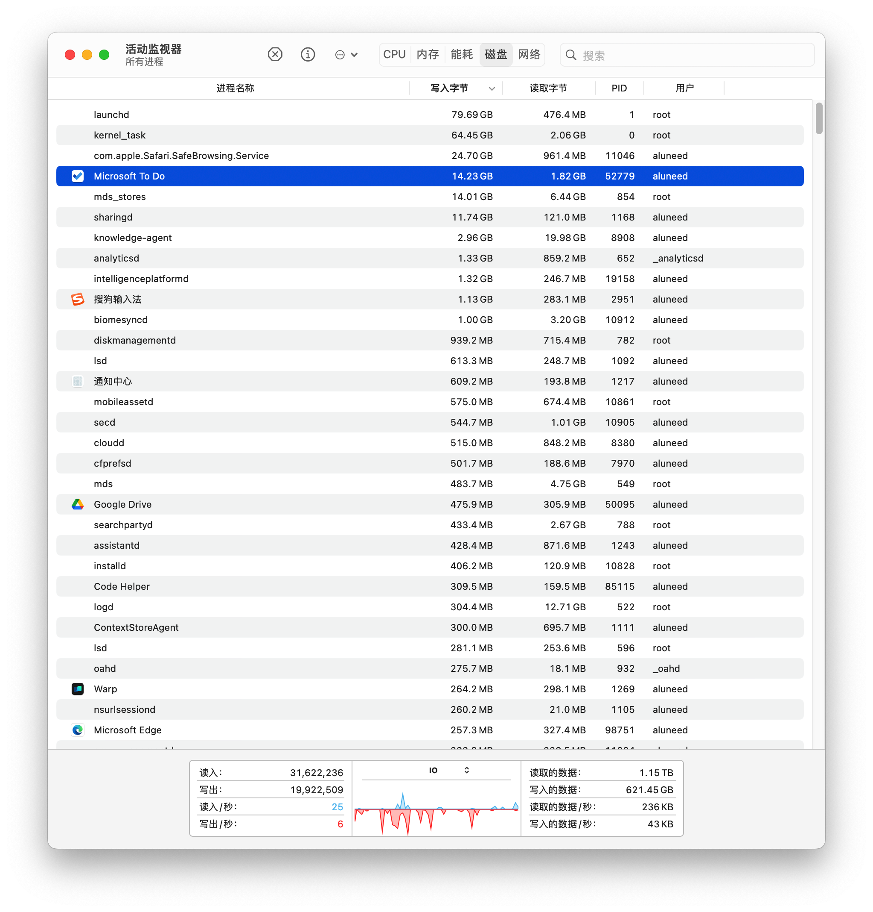
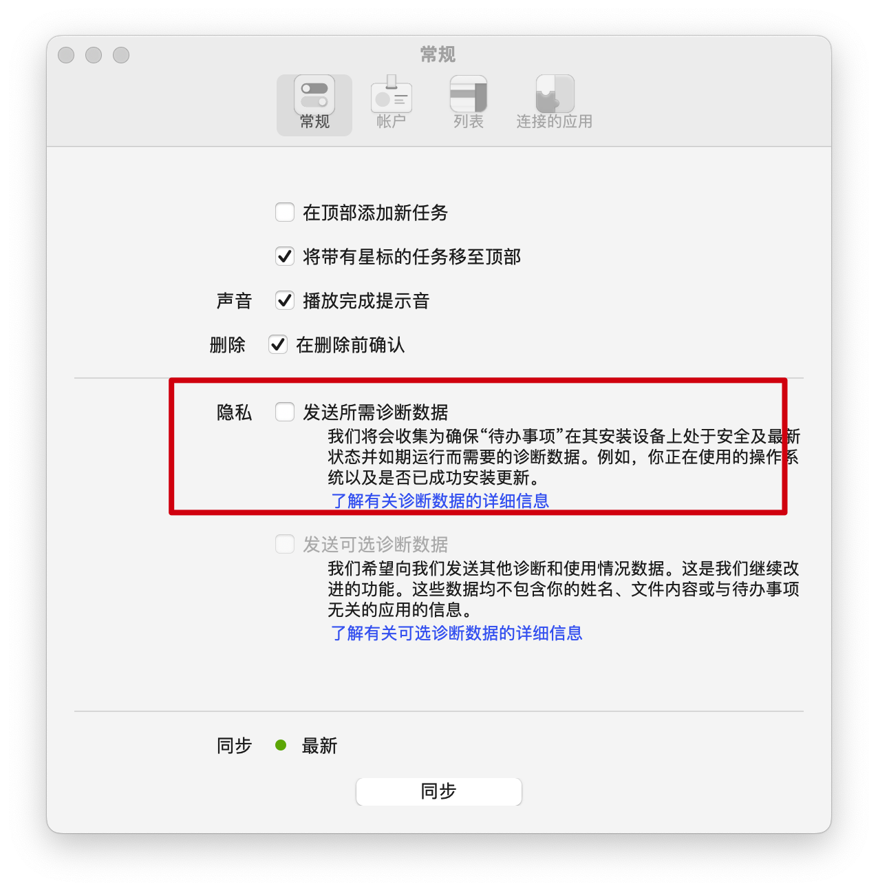
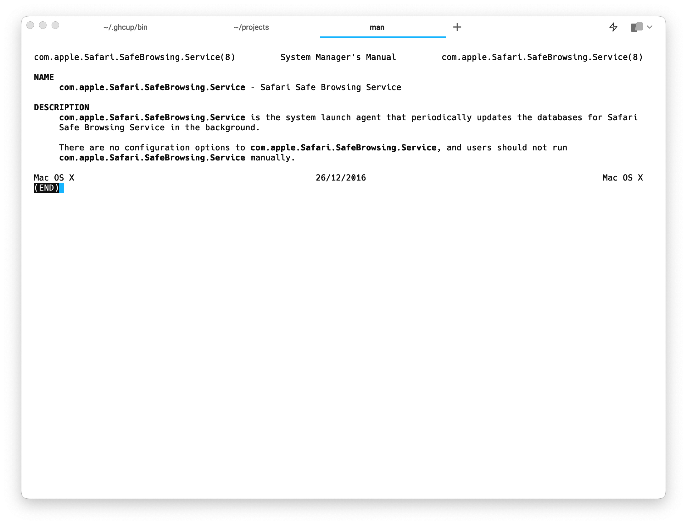
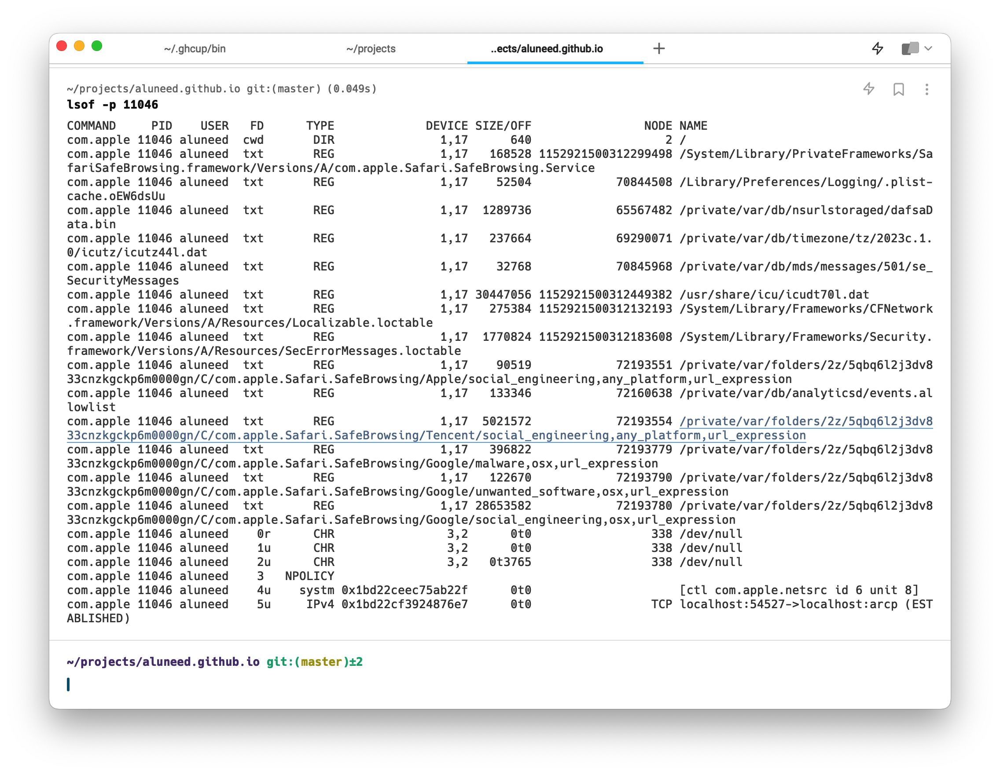

<!--meta
id: 3
title: microsoft todo的致命问题
date: 2023-04-25
tags: app, microsoft
category: blog
type: blog
meta-->

看了眼磁盘io, 一看吓一跳  
wtf

  

https://techcommunity.microsoft.com/t5/microsoft-to-do/high-disk-usage-while-ms-todo-is-running/m-p/2831239

很容易找到解决方案, windows上也会有同样的问题  

  
关掉诊断数据就行了

上一次看就已经有大量磁盘写入, 我以为是ms todo更新太频繁导致的  

虽然很容易解决, 但是这个问题, 非常严重  
它不容易被发现, 并且会实际减少硬件寿命  
我当然不介意牺牲一些性能来提供一些监测数据, 但我tm为了少点硬盘io, 连git repo都不会放到网盘里, 想从桌面上的mac切换到床上的macbook, 都得tmd先提交一次, 结果一个todo程序都能写一堆gb级数据到硬盘上, 👴🏻真的吐了  

查了一下上面那个`com.apple.Safari.SafeBrowsing.Service`也不是什么好东西, 更新个db就写几十gb  
https://apple.stackexchange.com/questions/452931/is-there-a-way-to-reduce-safe-browsing-data-written-on-mac-ventura  
这也是个老早就有的问题  
关闭safari中对应的设置之后, 重启了一次设备, 又试了试qq和chrome, 也没有重新开启这个进程  
看上去解决了  

  
  

至于别的

mds_stores和spotlight有关, quite fair  
sharingd和跨设备生态有关, 也还能接受  (https://lemp.io/what-is-sharingd-mac-os/)  
knowledge-agent和safari有关, 没什么用, 但也无所谓  

不知道为啥launchd的写入比kernel_task高, 前者似乎是后者的子进程  
