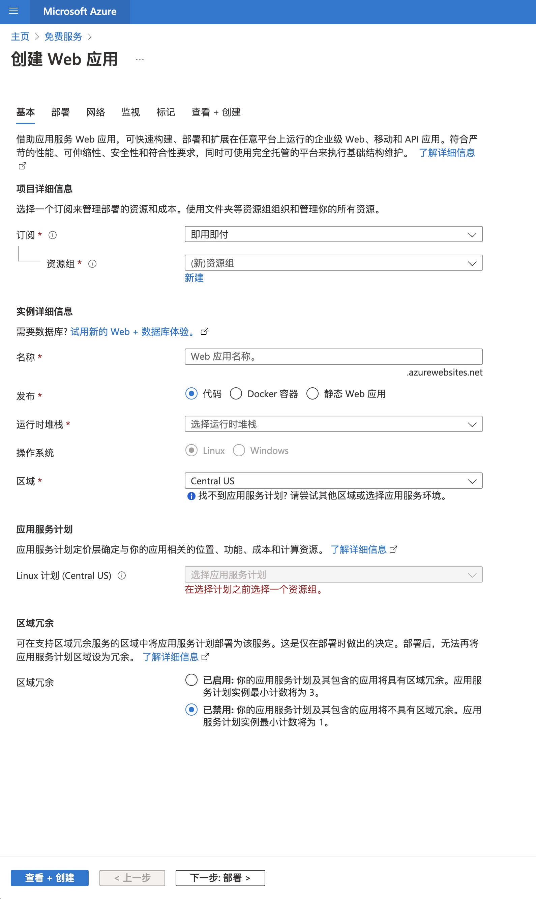
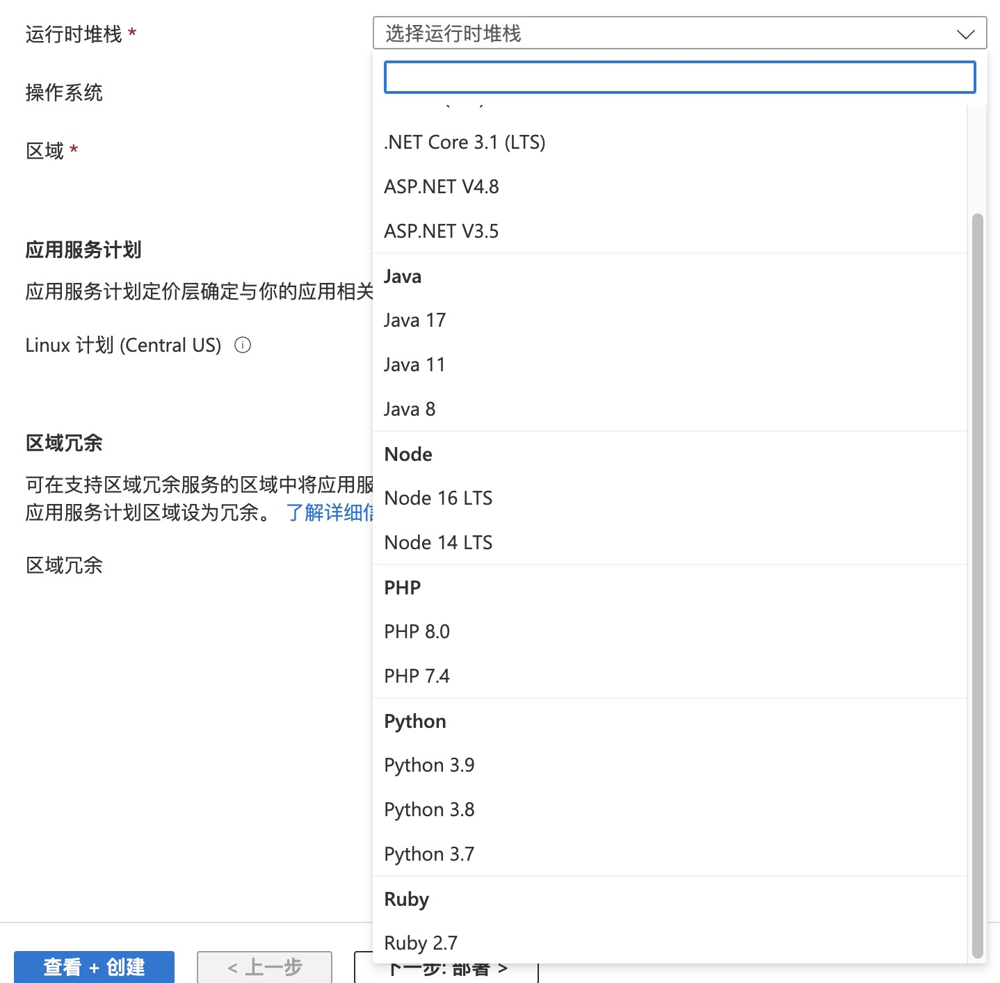
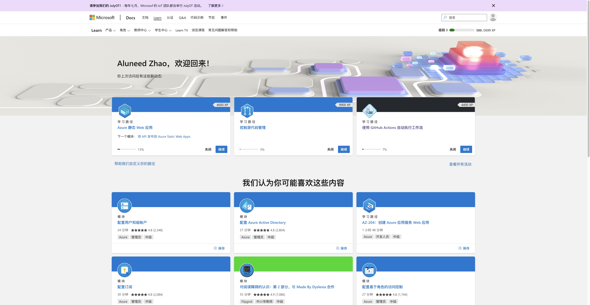
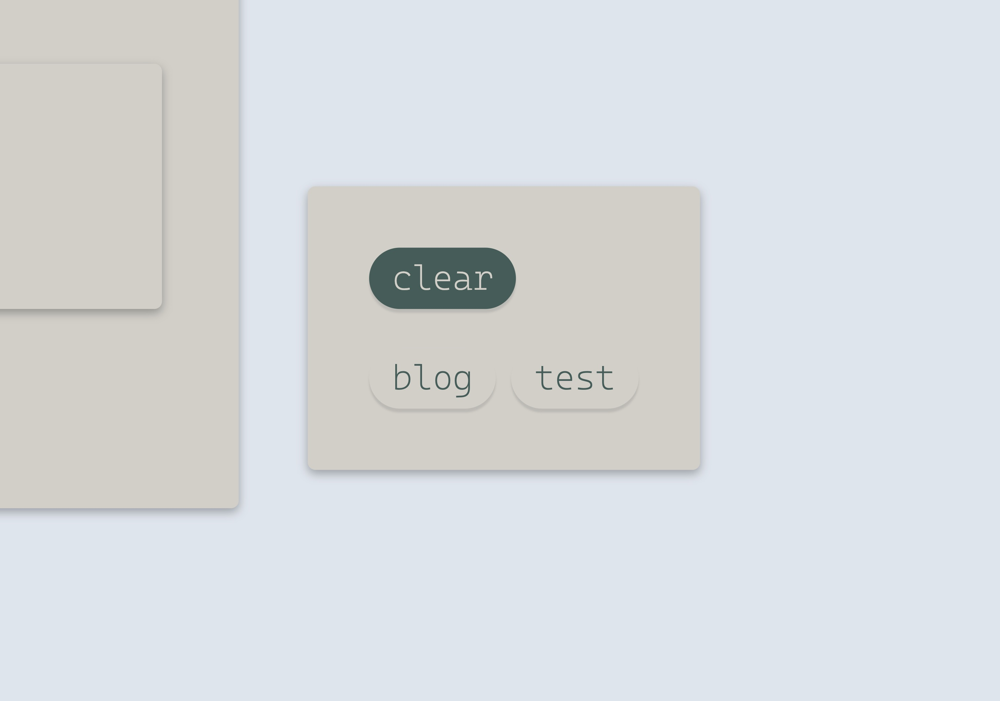
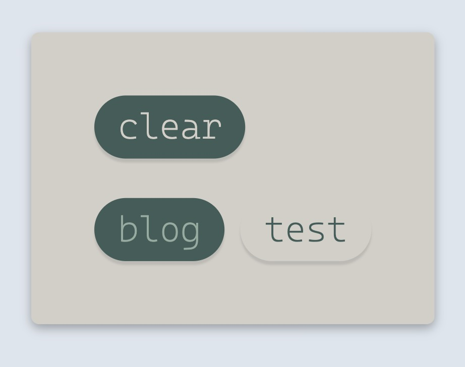
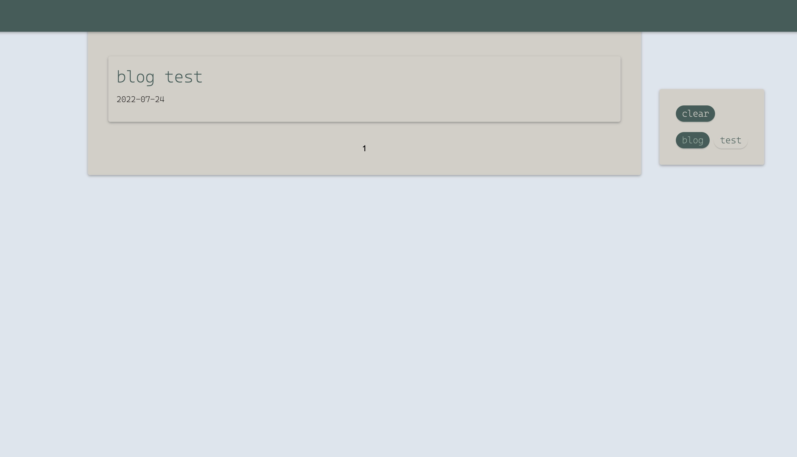
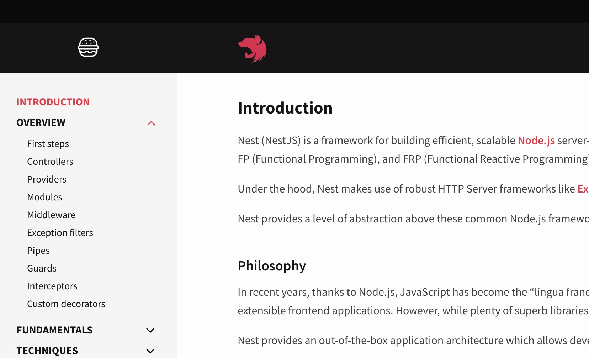
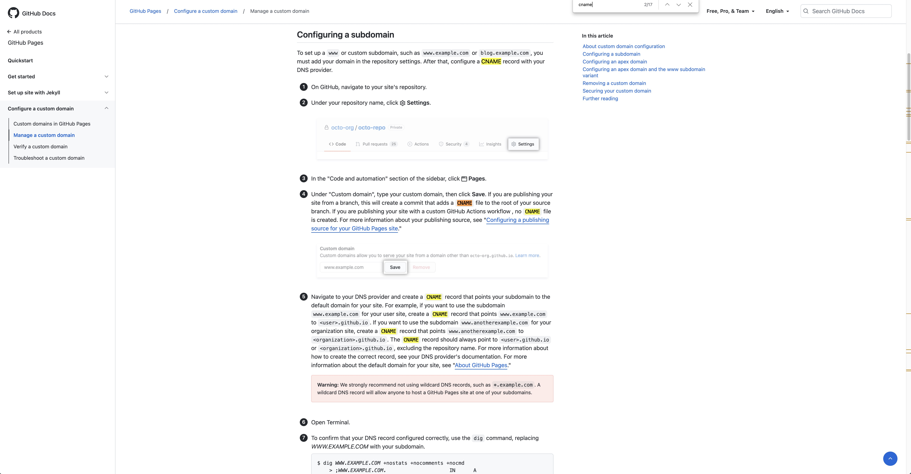

<!--
id: 1
title: 终于, 这玩意儿跑起来了
date: 2022-08-01
tags: frontend, angular, deno, typescript, blog, web
category: blog
type: blog
-->

我从未想过自己还能写出这样一坨💩山  

## 💩一系列尝试

去年就开始尝试从零开始构建一个博客  

最初是手写的html+css+javascript  
这实在是一种折磨  
也难怪几十年前只要写个网页就能算是工作  
工作不在于输出多少内容, 而在于承受多少痛苦  
在四处扒代码, 手写了一个导航条, 一个侧边栏, 再加上一个只能显示下文本的主要容器后, 我停止了对自己的折磨  

之后则是angular  
选择angular有着极为深刻的理由, 任何前端架构师或者别的什么人都难以想象  
当时我认为facebook是一家邪恶公司, 我当然不会用邪恶公司的react  
而vue, 知乎上的一些相关问答, 让我对它的粉丝和它的主理人感到恶心  
当然, 另外一大原因, 比起javascript, 我更愿意接受typescript  

前端的选择一直延续到了现在, 但中间经历了数据源的变化  
在最初手写静态网页时, 我就考虑过手动构建索引  
但在使用angular构建了一个看上去能用的网页应用后, 我又开始尝试采用quarkus服务来作为后端  

这没什么问题, 花不了十个小时就能解决问题  
问题来自于运行环境  

我最初的选择是azure的应用服务, 配置够用, 完全免费, 看上去很美好  

然而它带来的是更多的限制, docker相关设施只能用azure的服务, 数据库只能用azure的服务, 除了应用服务中的代码, 全得用azure的付费服务  
此外, 免费的azure服务是有CPU时间配额的, 而且在一段时间中没有访问时, 还会自动释放资源  
直到我发现每隔一段时间第一次访问服务时都要登上一分钟时, 我才明白"释放资源"是什么意思  
以及"云原生"究竟意味着什么  
得益于graal, quarkus对云原生支持很好, 但对想要白嫖azure服务的人来说支持并不好  
当时我并没有尝试采用更加轻量的runtime来构建应用, 现在看下来nest.js或者deno可能会是不错的选择(至少比非native的java应用更好更轻量)  

时至今日(2022-08-01), azure web application仍然没有支持deno作为runtime, 在不使用docker的情况下, 为了node生态, nest.js可能会是比deno更好的选择  


azure值得夸奖的是和github actions的集成, 只需要在azure的管理界面点点设置就能完成, 在github的repo中不需要任何操作  

之后的选择则是腾讯云和阿里云  
在花了无数时间尝试之后, 我还是在审核阶段被拦住了  
我曾经在阿里云上购买过域名, 也成功备案过, 但这是一次无法复现的成功  
腾讯云则是压根不给我购买域名的机会  
在namesilo上选到域名后, 通过cloudflare中转, 解析到腾讯云服务器的ip上, 结果是意料之中的备案提醒  
而腾讯云, 压根不受理没有迁入自家dnspod服务的域名备案委托  
虽然没有域名, 但80端口仍然可以通过http/https正常访问  
这玩意儿最终成了测试服务器  
折腾一段时间github actions之后, 前后端两个仓库都能在收到更新后自动部署到这个服务器上  
遗憾的是, 这在当时并没有成为我快速迭代的助力  
没有下游的测试, 这个环境对我来说毫无价值  

aws很早就白嫖过了所以放弃  
虽然还有oracle cloud always free, 但当时困于服务端的网页渲染问题难以解决  
虽然考察了一下express和angular的继承, 但几次失败的尝试之后还是放弃了  
最终决定转回构建静态页面  

## 💩静态web应用

虽然老早就画过原型也做了界面设计, 但在经过之前的尝试之后, 思路变得更清晰了一些, 砍掉了很多想法, 只保留了核心需求  
* 好看的界面
* 分页
* 标签筛选
* md文档显示
* 根据md文档来构建索引, 并且这个过程要能在ci/cd中进行

### 好看的界面  

就一个*博客*而言, 包含交互在内, 单纯*设计*一个好看的界面并不是什么难题  
只要布局合理(我抄了angular的官网, 并且参考了vscode的文档), 再加上欣赏的配色, 就不会有什么大问题  

为了让不同内容看着不那么单调, 选择阴影来营造简单的层次效果是很自然的事  
关键在于阴影的范围和浓度  
我希望页面不同部分在保持自然的同时能和其他元素明显区分, 因此选择了小范围但渐变较少的阴影  
为了匹配这种风格的阴影, 矩形元素的圆角采用了较小半径的4px  
另一种风格则是macos ui上常见的大圆角+大范围阴影, 但我不希望页面上的元素和周围太过于割裂  
作为中间主要显示区域的container部分, 顶部没有采用圆角, 而是保持直角以营造被toolbar遮挡的效果  
这种灵感来自于<https://docs.microsoft.com/zh-cn/learn/>中的卡片  
  
这些卡片看起来不差, 但我始终想不明白它设计师出于什么理由做出这样的设计  
toolbar也没有采用圆角, 这是因为toolbar扮演了和整个窗口一体的角色  

tags filter使用了angular-material提供的chips组件  
最初我一直很犹豫如何用色彩来使chip和周围的背景做出区分, 因为选定状态和非选定状态会分别占用一套色彩方案  
最终在非选定状态保持了背景颜色一致, 字体颜色采用主色调, 保留下半部分的阴影, 上半部分没有阴影, 和背景融为一体  
只靠下半部分的阴影来做出和背景的分隔  
和矩形的卡片不同, 这种效果使得非选定状态的chip和周围十分一体化, 但又不至于看不出范围  
  

选定状态的按钮背景反色成主题颜色, 但字体保持浅绿  
这是为了和`clear`按钮做出区分  
  
`clear`按钮的浅色字体和背景就是非选定状态的chip简单调换颜色的结果  
相比选定状态的chip, 按钮的字体颜色更浅更明亮  

  
在开始html+css+js的第一动工前, 我就已经想好了页面的动画  
点击博客标题后, 小卡片会经由动画放大至整个内容container, 而中间的内容渐变刷新为博客内容  
同时右边作为`tags filter`的pannel转变为博客md文档的目录, 组件也经过过渡动画缩放为合适的大小  
toolbar则显示当前阅读的位置, `/blog/blog-name/h1/h2`大概如此  
在页面顶部或底部加上进度条, 显示当前的阅读进度  

在尝试了一下为angular组件以及组件路由过程加上过渡动画之后就放弃了  
最大的负反馈不是这些尝试没有得到该有的结果, 而是我完全不知道是哪里出了问题  
不知道专业前端在为组件添加动画时会花多少时间, 但对我来说, 在毫无经验的情况下继续投入时间精力以得到结果的希望十分渺茫  

字体的选择十分简单  
我选择了cascadia code  
这个字体被官方称为一种"活泼"的字体, 主要为了terminal设计  
实际上我在terminal中使用`fira code regular`, 在warp中使用默认的`Hack`, 在jetbrains产品中也使用默认的`jetbrains mono`  
在vscode中我目前使用`cascadia code semilight`, 但体验算不上良好  
在编写这个静态网站时, 不知道是采用了不习惯的2空格缩进的原因, 还是字体的原因, 或者两者兼有, 阅读的体验并不算好  
但作为网页的ui字体, `cascadia code`无疑是一种绝佳选择  
它的[license](https://github.com/microsoft/cascadia-code/blob/main/LICENSE)十分开放  
extralight的字体极富设计感  
更重要的是, 虽然它被称为一种`fun`的字体, 但在稳重的配色下会呈现出非常复古的风格, 却又不会显得古板  
在最早的尝试中, 我甚至采用ligature的字符组合来表示一些图标  

在配色方面, 除了黑色, 包括链接的hover在内, 我只采用了`gmk botanical`这套键帽的配色  
  
众所周知, 四种颜色足以在任何情况下区分平面上的任何区域, 只是如何搭配需要花点心思  
material组件提供的调色盘渐变方案并不完全满足我的需要, 因此很多地方的颜色都经过了手动配置  

最后, 网站的logo, 在pixelmator pro中, 我找到了一个带有刘海屏笔记本的图标, 填入主题配色之后就完成了  

在我编写这篇md文档并且采用vscode进行预览时, 我又发现了一个事情: 除非为图片加上了边框进行分隔, 不然就不要采用纯白色作为背景底色, 否则与具有纯白底色的图片难以区分界限  

虽然很多细节设计(或者我无法/没空实现的部分)很糟糕, 但是良好的色彩决定了较高的下限  

### 分页  

最初分页的尝试是在一个json数据中进行的  
当时我还在使用copilot, 输入了page云云几个字母之后, 很快就出现了大段的提示, 并且看上去跟我想象地一致  
虽然后续有所修改, 但那段代码的逻辑一直被沿用到现在  
分页后显示的索引也和我预想的一致, 这种设计参考了一个常用网站  

这当然没有任何问题, 问题在于tags filter的结合  

筛选之后, 需要进行分页的目录发生了改变  
最初我在显示目录的组件`content-list`中, 直接在初始化时进行赋值, 获取了`pageService`中的分页结果  
然而在`pageService`中经过tag筛选, 发生状态改变之后, 结果并没有传递到`content-list`中  
这是因为`content-list`赋值时获取的是`pageService`中目录列表的引用, 而非它本身  
也就是说, 这两个变量并不是别名的关系, 而是将一个变量当时的引用传给另一个变量  
我很少写这种可变状态量直接赋值的代码, 也因此踩了坑  
正确的做法应该是使用rxjs进行subscribe, 但当时我简单地创建了一个buffer, 通过buffer来传递页面需要显式的目录  
当然使用buffer时也遇到了清除缓冲区的问题, 很久不用buffer的我最初忽略了这一点  

当然在最后, 我发现并不需要什么buffer或者subscribe, 在`content-list`的html模板中, 可以像`this.pageService.indexlist`这样直接使用`pageService`中的变量, 虽然这样会使得模板和服务严重耦合  

综合来看, 使用rxjs进行监听才是正确的做法  

在最初的代码中, `当前页面`的状态被直接存在`pageService`中, 这导致了页面刷新后丢失状态, 在写tags filter时我才着手解决这个问题  

### 标签筛选

现在看起来没什么大不了的  
但在最初编写的时候, 快把我搞晕了  
为了和标签的按钮联动, 于是有了一组标签的可变状态  
在这些可变状态变更时, 还要对目录列表进行变更  

最初的设计中, 我采用`或`的逻辑来处理多个标签之间的关系, 也带来了不少麻烦  
这是因为在没有选定任何标签时, 目录应当呈现出全选而非全不选的结果, 这和筛选的逻辑并不相同, 需要特殊处理  
于是又引出了标签选择计数的问题, 这又是一个新的需要维护的可变状态  
虽然解决了这些问题, 但最终还是采用了`和`的关系来进行筛选  

包括当前页的状态和所选标签的状态在内, 存储在`pageService`的变量中的状态在刷新后就会丢失  
在经过提点之后我才知道有`localStorage`这玩意儿  
何时将状态保存到`localStorage`也是个问题  
当前页的状态是无所谓, 但保存tags筛选的状态是一笔不小的开销(至少我猜是)  
当然最终找到了`window.onbeforeunload`这玩意儿, 它在刷新或关闭窗口前发动亡语  
我希望刷新和关闭窗口时有不同的行为, 但找了很久也没有找到如何进行区分  
最后才发现`sessionStorage`能满足我的需求, 它在关闭窗口后会清除状态, 但刷新不会  

虽然是很基础的东西, 但知道和不知道, 带来了巨大的差异  

### markdown文档显示

最初我打算自己写一个解析器, 或者类似`transpiler`的东西在构建angular项目之前就把markdown文档转译成html文档  
markdown语法很少, 一个pass就能解决  
但考虑到表格的显示, 代码块的显示和高亮, 甚至对`mermaid`的支持, 我最终放弃了这个想法  
写parser, 还是markdown的parser, 本身也是一件毫无意义的事情(后续还得调整css)  

最终找到的是 [jfcere/ngx-markdown](https://github.com/jfcere/ngx-markdown) 这个组件  

在<https://github.com/jfcere/ngx-markdown#main-application-module>中, 它提到可以通过在引入模块时进行配置`MarkdownModule.forRoot({ loader: HttpClient })`, 然后在html模板中通过`[src]="url"`来引入md文档  
实际上我在编写`content-container`时才了解到, 这种内容访问仍然需要http来进行, 而非直接通过path进行访问  
仔细想想这是其实是合乎直觉的, 因为在点开博客页面前, 客户端的资源并不包含博客md文档  
这一步已经在`content-container.component.ts`中做了, 因此还是采用`[content]`进行内容输入  

我还没有仔细对这个markdown组件进行配置, 但很快就发现, 它的图片显示功能无法满足的需求  

markdown的标准中, 图片的尺寸无法受到控制  
这对网页来说显然是难以接受的, 图片会直接保持原始尺寸然后溢出  

被`ngx-markdown`继承的主要md解析组件`marked.js`中, 出现了不少相关issues  
<https://github.com/markedjs/marked/issues/339>  
<https://github.com/markedjs/marked/issues/1279>  

marked.js的文档中也讲了如何改写renderer(这种renderer实际上是将markdown转译为html的组件, 而非html的渲染)  
<https://marked.js.org/using_pro>  

然而在一番尝试之后, 改写的renderer始终无法生效  
甚至在调用`marked.parse()`时, `baseUrl`的配置和图片解析的配置都会发生冲突  
我怀疑这个解析是在一个pass中进行的, 因此对同一元素的多次处理只有一次生效  
当然没有看源码也无法确证  

最终在`/src/style.css`中做出了`img`元素样式的全局设置  
之前尝试在`content-container`组件中试图对`img`的样式进行改变, 但并没有生效  
甚至在`app.component.css`中进行更改也没有生效  
我猜想这是因为marked.js组件和angular处于平级关系, 没有受到angular管理  

后续准备能加上点击图片查看大图的功能, 然而marked.js并不是那么好用, 如果不能通过全局css实现的话, 可能会变得异常困难  

代码块以及语法高亮的配置也还没尝试  

### 构建索引

实际实现的时候, 没有怎么考虑就选择了deno  
js或python我不喜欢, 一些其他脚本语言则属于others  
java干这事有些臃肿, 有些大材小用, go则让人毫无欲望  

在使用typescript的过程中, 我发现它并不是一个幻想中的完美语言, 但并不至于让人厌恶  
nest.js和deno的取舍算是值得思考, 但我想要的是尝试一种全新的runtime, 而非构建于node上的框架  
最关键的在于, deno无论是网站还是logo都比nest.js更吸引人  
  
不知道是谁想出来的把一个汉堡放在一个猫头边上当做侧边栏的切换按钮的  

deno从安装到文档都不错  
遗憾的是, 在vscode中, deno的插件支持算不上好  
有一些相关issues  
<https://github.com/denoland/vscode_deno/issues/66>  
<https://github.com/denoland/vscode_deno/issues/260>  
或许能解决问题, 但对我影响不大, 所以暂时还么尝试  

另一方面, 我希望能把ide切换到webstorm  
每天都在windows和macos之间切换, jetbrains系的ide快捷键就有所差异  
再加上vscode差异会带来太大负担  
毕竟按快捷键都是肌肉记忆  
vscode并不符合我的使用习惯, 但还不知道webstorm对deno的支持如何(包括angular也是)  

最初我打算把博客文档的元数据写在开头由两个`---`分隔的区块内  
```markdown
---
metainfo
---
```
在deno-blog这个项目以及vscode内置的md预览中, 这些信息会被隐藏  
然而在github和idea的md解析器中, 这些内容则会显示出来  
我希望作为博客的md文档在多数地方都能有相同的表现, 因此最终决定采用html注释来异常博客元数据  
这是一种约定的, 不健壮的方案  

构建索引的过程也十分简单  
遍历`/posts`下的文件, 读取开头注释掉的博客元数据, 然后构建一个`.ts`文件作为索引  
这是一种有缺陷的做法, 因为这个`.ts`文件会被编译进angular应用, 必须经过重新构建和打包发布才能生效  
正确的做法是构建一个索引文件, 然后在angular应用中读取索引文件来初始化数据  
最初我打算使用json来作为索引文件格式, 这样方便后续的交互  
然而无论是在构建json文件还是读取json文件时, 我都遇到了麻烦  
这种麻烦还是来自于对前端js代码生态的不熟悉  
手写一个json序列化和反序列化工具也不是什么问题, 后续可能会完成这个事情  

构建索引的同时还需要对标签进行统计, 这也没什么好说的  

## 💩部署

首选的平台当然是github pages  

问题在于要不要把angular项目的源码放入`<username>.github.io`的仓库内  
是通过另一个仓库触发构建actions, 然后推送并更新github pages所属的仓库, 还是直接在仓库内更新博客触发构建?  
当然是在pages仓库提交博客并触发构建了  

测试之后很快发现了第一个坑: 单页面应用程序跑在github pages上时, 路由跳转后会直接进入github的404页面  
搜了一下很快就发现了解决方案, 复制一份angular的index.html模板文件到404.html  
之前看github pages相关的介绍时就很奇怪为什么每个人都提到了自定义的404.html文件, 这时才明白是为什么  
我猜想github pages的策略大概是在仓库内根据http的url查找仓库内是否有对应的html文件, 如果没有就直接重定向到404页面  
也就是说, 通过浏览器的url进行路由之前, 会经过github pages的进行处理, 而不会进行路由  
这类似于如果一个后端接口的url和路由的url冲突, 那么浏览器访问的会是接口url而非进行路由跳转  

由于目前索引是ts文件, 重建索引后需要重新构建angular项目, 因此只能加入源码  
并且现在static-blog本身也并不完善, 还会不断更新  
后续完善项目并改变索引读取的方式后, 则可以只加入构建后的静态网站应用  
每次在`<username>.github.io`中更新博客后, 只需要在actions中重建索引并提交即可  

为了划分源码和构建后的静态网站应用, 我将构建结果放到了`/docs`中, 并且在pages的设置中选择这个路径作为网站的根目录  

问题就这样发生了  

我的域名提供商是namesilo, 域名被解析到cloudflare上, 通过cloudflare中转到github pages  
这时需要在对应的github repo中加入`CNAME`文件, 并在其中写且仅写上域名  
根据github pages的文档, 这个文件应该放在source branch的根目录中    
  
我当然是照着文档做的  

然而通过自定义域名访问网站后, 很快便出现了一些页面刷新后无法访问的情况  
比如`benkyou.dev/index.html`  
在pages的设置中, 原先自定义好的域名又会恢复为`<username>.github.io`  
我最开始以为这是cloudflare的问题, 或许是dns设置问题导致了pages检测失败之后重置了域名  
不管是修改dns解析规则还是清空缓存, 经过几次尝试后无疾而终  
甚至删掉github repo重新导入项目后也没有解决  
查了一圈后发现爆栈网上很多人也遇到了类似的问题, 但他们的问题都是因为仓库根目录中缺少CNAME文件引起的  
他们的项目构建和重新发布后会丢失CNAME文件  
我再三检查也确定没有丢失CNAME文件  

最终看了commit记录, 发现了大量的CNAME创建和删除记录  
原来创建操作是在pages设置中修改自定义域名时创建的  
这个CNAME文件是创建到`/docs`目录中的, 和文档中以及爆栈网的各种回答中的叙述并不一致  
我在每次发布时确实会清空`/docs`中的文件  
于是每次在pages设置中自定义域名后, 都会自动添加CNAME文件, 通过自定义域名都可以短暂访问  
然后触发的下一次构建则会删除这个CNAME文件  
自定义域名访问的结果就只剩下原有的缓存  

踩这个坑源于不完善的文档, 就算是在[这个文档](https://docs.github.com/en/pages/getting-started-with-github-pages/configuring-a-publishing-source-for-your-github-pages-site)中也没有提到CNAME文件的位置问题  
然后深陷于对问题的错误猜测, 在cloudflare设置中浪费了大量时间  

在部署过程中, 采用`/dist`到`/docs`的复制, 是为了完成后续向不同平台分发构建好的静态资源  
github pages中的东西和通常的平台还是略有不同  

即将加入的平台当然会有azure的静态应用, 毕竟这个完全不用操心费用了  
也许会有cloudflare pages, 再看看oracle cloud有没有能白嫖的资源  
gitee虽然也是一个选择, 但不知道大和谐事件后的现在状况如何, 我为gitee感到惋惜  

## 💩总结  

也许是因为采用了不熟悉的技术和工具, 干不熟悉的事, 才导致了💩山的诞生, 虽然这个static-blog还没有达到可以称之为山的程度  
或许直接上手公司的前端项目, 根据浏览器上应用表现出的pattern找到想要实现的功能, 然后复制粘贴一些代码再调试, 会有更快更直接的学习效果  

经过一系列的折腾, 也算是扩展了一下知识的边界, 即便都只是些trivial乃至于shallow的东西  

要问这些东西是不是值得忍受踩坑时险些一拳打穿显示器的愤怒, 我也很难回答  

接下来要做的事情:  
* 分发cascadia字体  
* 处理一些移动端上的样式显示问题  
* 索引方式修改, rxjs订阅目录列表  
* markdown代码块显示配置, 图片显示修改  
